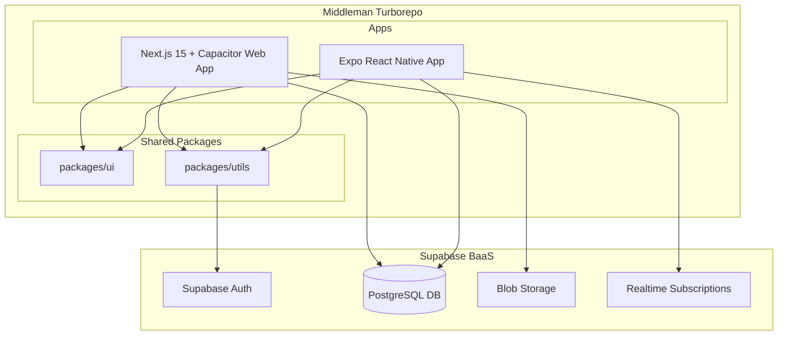
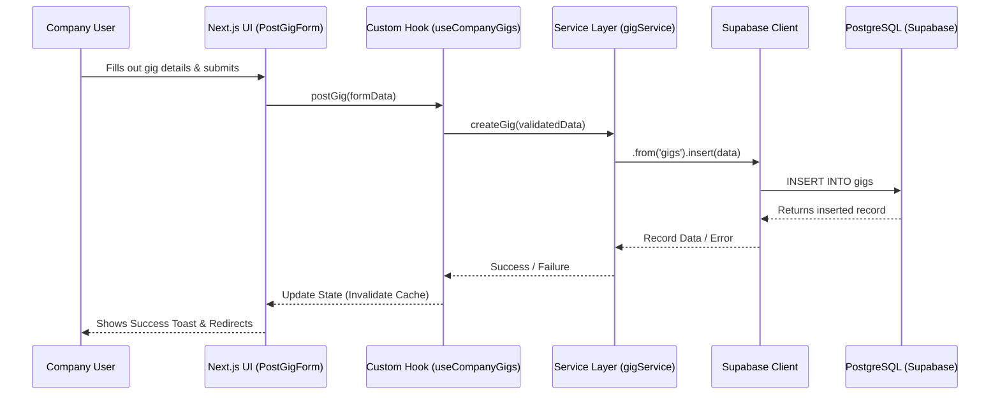

The Middleman monorepo is a robust, multi-platform gig economy application designed to connect freelancers with companies, overseen by an admin portal. Engineered for high performance and cross-platform compatibility, it utilizes a modern stack tailored for speed and scalability.

### Project Overview

The core purpose of the application is to facilitate the lifecycle of freelance gigs—from posting and discovery to execution and verification.
**Primary Tech Stack:**

* **Workspace:** Turborepo (`pnpm` workspaces) for managing multiple apps and shared packages.
* **Web/Hybrid Client:** Next.js 15 (App Router) wrapped with Capacitor 8 for cross-platform delivery.
* **Native Client:** React Native (Expo Router) for dedicated mobile deployment.
* **Backend/BaaS:** Supabase (PostgreSQL, Authentication, Real-time Subscriptions, Storage).
* **Styling:** Tailwind CSS (Web) and NativeWind (Native).
* **Testing/QA:** Playwright (E2E), Vitest (Unit), Jest.

### Architecture Breakdown

The system follows a **Component-Based, Layered Architecture** integrated with a Backend-as-a-Service (BaaS) model.

**Folder Structure Logic:**

* `apps/web/`: The Next.js 15 application containing role-based route groups (`(auth)`, `(dashboard)/admin`, `(dashboard)/company`, `(dashboard)/freelancer`). It separates concerns into `components`, `hooks` (business logic), `services` (data fetching), and `lib` (utility/infrastructure).
* `apps/native/`: The Expo application mirroring the route structure for mobile-first interactions, heavily relying on native capabilities (maps, geofencing, haptics).
* `packages/ui/` & `packages/utils/`: Shared libraries establishing a single source of truth for UI components and core utilities like the Supabase client and auth states, ensuring DRY principles across web and native boundaries.

### UML & Flow Diagrams

#### Component Architecture Diagram

#### User Flow Sequence Diagram: Company Posting a Gig

### Code Interaction & Data Flow

**Entry Points:** The primary entry points are `apps/web/src/app/layout.tsx` and `apps/native/app/_layout.tsx`. These establish the global context, including error boundaries, query clients, and authentication providers.

**Data Flow:**

1. **Routing to View:** Next.js/Expo Router handles the URL/deep-link, rendering the respective page/screen protected by route guards (e.g., `AdminGuard`, `FreelancerGuard`).
2. **State & Hooks:** UI components delegate business logic to custom hooks (e.g., `useGigs`, `useProfile`).
3. **Service Layer:** Hooks interact with isolated service files (`gigService.ts`, `authService.ts`), which contain the exact Supabase queries. This abstraction keeps components clean.
4. **Real-time:** WebSockets (via `useGigsRealtime.ts`) listen for database mutations, pushing updates back to the UI state without manual polling.

### Implemented Features

* **Role-Based Access Control (RBAC):** Distinct dashboards and routing guards for Admins, Companies, and Freelancers.
* **Gig Lifecycle Management:** Posting gigs, viewing available work, tracking ongoing gigs.
* **Location Services:** Map viewing (`MapViewer.tsx`, `NativeMapViewer.tsx`) and geofencing hooks (`useGeofence.ts`) for location-based task verification.
* **Device APIs:** Native and Capacitor-bridged implementations for Camera (`useCamera.ts`) and Haptics (`useHaptics.ts`).
* **Security & Audit:** Data sanitization utilities (`sanitize.ts`), rate limiting (`rateLimit.ts`), and comprehensive audit logging (`auditLog.ts`).
* **Document Handling:** Secure file uploads via `DocUploader.tsx`.

### Missing Pieces & TODOs

* **Payment Infrastructure:** There is no visible integration for handling financial transactions (e.g., Stripe, PayPal) between companies and freelancers.
* **Messaging System:** A real-time chat interface for companies and freelancers to communicate regarding active gigs is absent.
* **Offline Mutation Sync:** While there is state management, robust offline caching with mutation queuing for mobile devices dropping connectivity needs formalization.
* **Advanced Error Recovery:** The current `ErrorBoundary.tsx` is basic; retry mechanisms for failed network requests could be strengthened.

### Maximizing the Lighthouse Score

Achieving a flawless Lighthouse score demands addressing performance-critical optimizations and bundle size reductions:

1. **Strict Code Splitting & Dynamic Imports:** Map libraries and heavy UI components (like dashboards) must be dynamically imported using `next/dynamic` to shrink the initial JavaScript payload.
2. **Asset & Image Optimization:** Replace all standard `` tags with Next.js `<Image>` components. Ensure responsive sizing, WebP formats, and lazy loading for assets below the fold.
3. **Refactor Re-renders & Client Instantiation:** Ensure the Supabase client is instantiated as a singleton. Avoid re-creating the client inside component bodies to prevent memory leaks and unnecessary DOM repaints.
4. **Tree Shaking & Tailwind Purging:** Audit `package.json` for unused dependencies. Verify that `tailwind.config.ts` precisely targets only directories containing actual UI code to eliminate dead CSS from the production build.
5. **Security Headers & Middleware:** Implement strict Content Security Policies (CSP), HTTP Strict Transport Security (HSTS), and cache-control headers within `next.config.ts` and `middleware.ts`.
6. **Query Configuration:** Optimize data fetching with proper caching and deduplication. Ensure real-time subscriptions (`useGigsRealtime`) are properly unmounted to free up the main thread.

### Leveraging MCP & Antigravity Multiagent Systems

The Model Context Protocol (MCP) and multiagent systems can drastically accelerate your workflow and code quality:

* **Database Schema Introspection (MCP):** Connect an MCP server to your Supabase PostgreSQL database. This allows your AI assistant (like Cursor or an Antigravity agent) to query your live schema in real-time. When you ask, "Write a migration to add payment status to gigs," the agent reads the exact current table structure without you needing to paste definitions.
* **Automated Architectural Guardians (Agents):** Deploy an Antigravity multiagent setup where:
* *Agent 1 (The Optimizer):* Continuously scans new commits against Lighthouse best practices (checking for dynamic imports, image optimizations).
* *Agent 2 (The Security Auditor):* Reviews Supabase RLS (Row Level Security) policies and checks `sanitize.ts` usage before code is merged.

* **Contextual Refactoring:** Expose your Turborepo dependency graph to an MCP server. When refactoring `packages/ui`, the AI will automatically know exactly which `apps/web` and `apps/native` components depend on the changed component, preventing breaking changes across the monorepo.